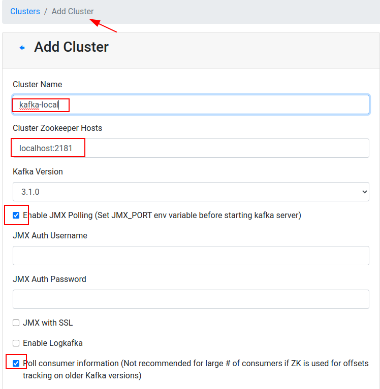
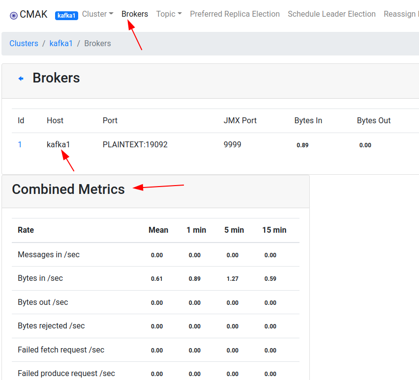

<link rel='stylesheet' href='assets/css/main.css'/>

# INSTALL-1: Kafka Native Install

## About Kafka Manager

In this lab, we will install a nice UI manager for Kafka - [CMAK - Kafka Manager](https://github.com/yahoo/CMAK)

For this we will use this image :  [elephantscale/kafka-manager](https://hub.docker.com/r/elephantscale/kafka-manager)

[Git hub repo for elephantscale/kafka-manager](https://github.com/elephantscale/kafka-in-docker/tree/main/kafka-manager)

## Step-1: Start Kafka Manager                          

```bash
docker run -d --rm --name kafka-manager -p 9000:9000  --net host  elephantscale/kafka-manager
```

A few things to note

* The default configuration looks for zookeeper in `localhost:2181,zookeeper:2181`
* You want to start the networking in `host` mode.  This way it can find zookeeper  at `localhost:2181`
* And map the port 9000 to container
* And we are naming our container `kafka-manager` for easy identification

Verify by

```bash
docker ps
```

You may see an output like this.

```text
CONTAINER ID   IMAGE                         COMMAND                  CREATED          STATUS          PORTS     NAMES
0cb44f25b7f5   elephantscale/kafka-manager   "/usr/local/cmak/bin…"   36 seconds ago   Up 31 seconds             kafka-manager
```

That means Kafka Manager container is running!


## Step-2: Using Kafka Manager

Go to port 9000 of your lab machine in your browser and you will see kafka-manager UI!

http://YOUR_IP_ADDRESS:9000 

replace YOUR_IP_ADDRESS with the IP of your lab machine

### 2.1: Register a Kafka Cluster


* Cluster name: can be anything you want, say `kafka-local`
* zookeeeper name: must be `localhost:2181`
* Enable JMX polling
* Enable consumer polling



### 2.2 - Click around and enjoy

For example, if you click on `Brokers` you will start seeing JMX stats showing up!



## Step-3: Stopping Kafka Manager Container

<span style="color:red;">Don't shutdown Kafka manager yet.  This is just for reference</span>

```bash
docker stop kafka-manager  # if you named the container as kafka-manager

# or 
docker ps
# identify the kafka-manager container id
docker stop   aaaabbbbccc
```
---

## End Lab

