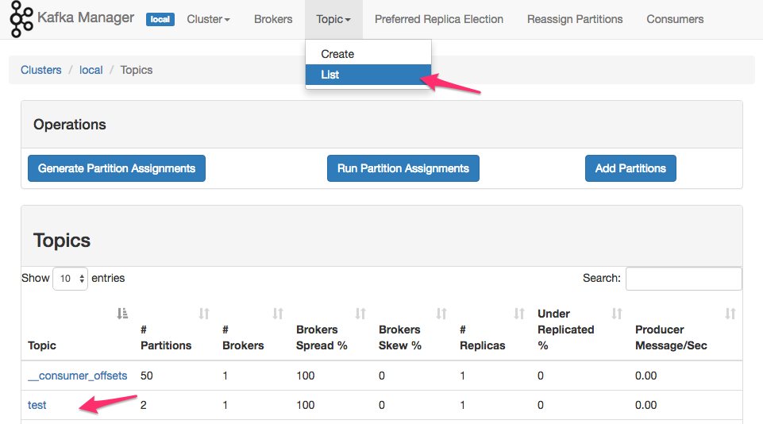

<link rel='stylesheet' href='assets/css/main.css'/>

# INSTALL-3: Test Kafka

## Overview

Let's test the Kafka we just setup.  We will use console producer and consumer.

## Runtime

10-15 minutes

## Step-1: Create a Topic

In a terminal, list the topics currently being managed by the broker:

```bash
~/apps/kafka/bin/kafka-topics.sh  --bootstrap-server localhost:9092 --list
```

You may see nothing or the internal topic `__consumer_offsets` used by the broker to remember where consumers have read from.

Let's create a `test` topic

```bash
~/apps/kafka/bin/kafka-topics.sh  --bootstrap-server localhost:9092  --create --topic test --replication-factor 1  --partitions 2
```

Verify:

```bash
~/apps/kafka/bin/kafka-topics.sh --bootstrap-server localhost:9092  --list


~/apps/kafka/bin/kafka-topics.sh --bootstrap-server localhost:9092  --describe --topic test
```



## Step-2: Start Console Consumer

On terminal-1 start `kafka-console-consumer`

```bash
~/apps/kafka/bin/kafka-console-consumer.sh  --bootstrap-server localhost:9092 --topic test
```

## Step-3: Start Console Producer

On terminal-2  start `kafka-console-producer`

```bash
 ~/apps/kafka/bin/kafka-console-producer.sh --bootstrap-server localhost:9092 --topic test
```

## Step-4: Send some data

On producer console, type some data as follows:

```text
1
2
hello world
```

You will see the data coming out on consumer terminal


## Step-5: Check Kafka Manager


## Tip: Shutting down Kafka

<span style="color:red;">Don't shutdown Kafka yet.  This is just for reference</span>

Use `jps` to find te process ids

```bash
jps
```

```text
1111 QuorumPeerMain
2222 Kafka
3333 Jps
```

Then issue a kill command to for approprite process ids

```bash
# replace it with correct process ids
kill  2222  1111
```

And kafka-manager can be stopped by

```bash
docker stop kafka-manager
```

Use the following command to make sure:

```bash
docker ps
```