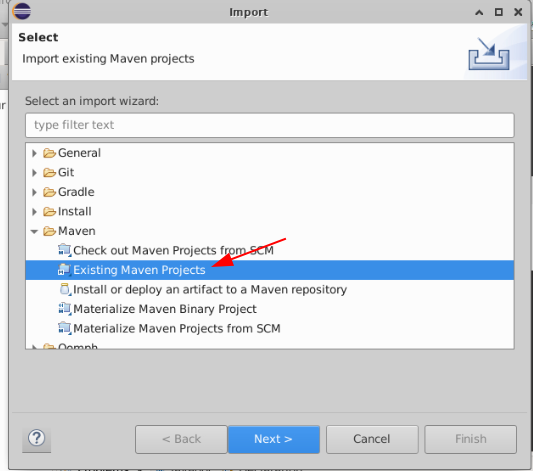

<link rel='stylesheet' href='assets/css/main.css'/>

# Lab: Code Setup

## Step 1: Grab lab code

### Option 1A: Download the zip file

Download the zip archive

```shell
wget https://exgnosis.org/resources/Labs.zip
```

Then unzip the labs

```shell
unzip Labs.zip
```


### Option 1B: Using Git

```shell
cd
git clone https://github.com/ExgnoRepos/2423-Kafka-Labs.git

```

## Step- : Login to cloud machine via VNC

Login via VNC


## Step 3: Bring up Eclipse


## Step 4: Import a Project

* In Eclipse choose 'Import Projects'
* 'Existing Maven projects'
* Open **`kafka-api`** project




## Step 5: Run Consumer

Inspect file : `labs/kafka-api/src/main/java/x/api/SimpleConsumer.java`

Run this file as a Java application.


## Step 5: Run Producer

Inspect file : `labs/kafka-api/src/main/java/x/api/SimpleProducer.java`

Run this file as a Java application.

You will see output like

```console
[DEBUG] 2022-07-17 14:16:53.581 [main] SimpleProducer:main(47) - Sent record [1] (key:1658092613570, value:Hello world @ 1658092613570), meta (partition=5, offset=45, timestamp=1658092613570), time took = 9.95 ms 
```

## Step 6: Verify data is going from producer to consumer

You will see messages showing up on consumer.

You might see messages like:

```console
[DEBUG] 2022-07-17 14:17:39.626 [main] SimpleConsumer:main(53) - Received message [1] : [ConsumerRecord(topic = test, partition = 3, leaderEpoch = 14, offset = 59, CreateTime = 1658092659615, serialized key size = 13, serialized value size = 27, headers = RecordHeaders(headers = [], isReadOnly = false), key = 1658092659615, value = Hello world @ 1658092659615)]
```

Also verify in Kafka Manager

