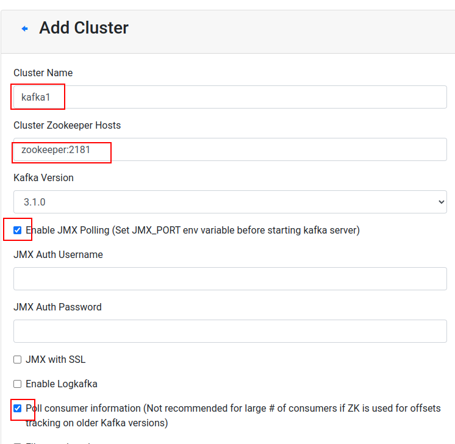
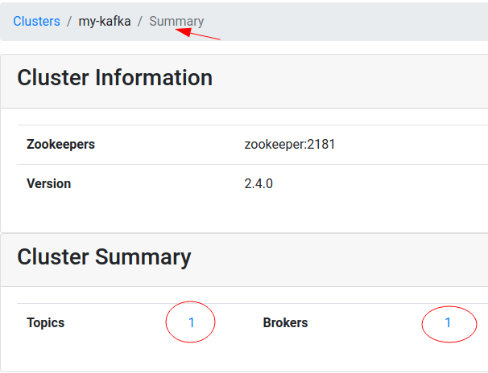
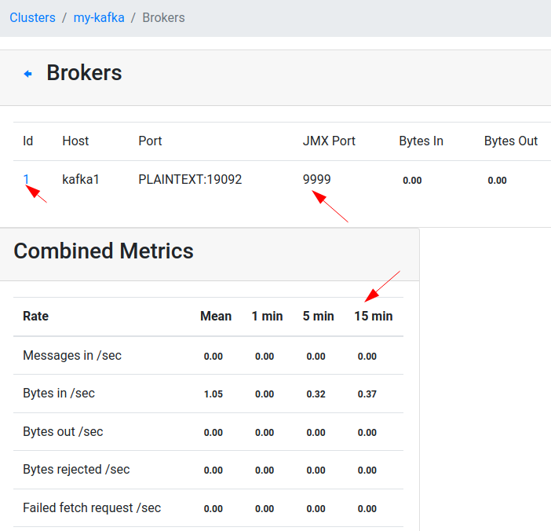
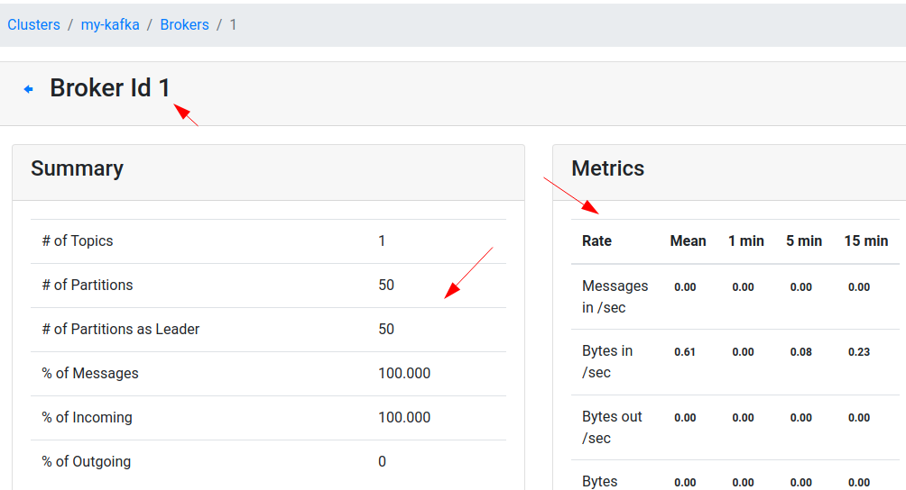

<link rel='stylesheet' href='assets/css/main.css'/>

# Dockerized Kafka - Single Node Setup

## Overview

We are going to run a single node Kafka using Docker

## Runtime

40 mins

## Step 1: Stop any Running Kafka

Check for running kafka and zookeeper using the jps command
```shell
jps
1111 QuorumPeerMain
2222 Kafka
3333 Jps
```
If they are running, then shutdown kafka

```shell
 ~/apps/kafka/bin/kafka-server-stop.sh
```

Then shut down zookeeper with the command below

```bash
~/apps/kafka/bin/zookeeper-server-stop.sh
```
And confirm with `jps` that they are no longer running.

Use `jps` to find te process ids

```bash
jps
7522 Jps
```

### Alternative Shutdown

Find the process ids for kafka and zookeeper.

```text
jps
1111 QuorumPeerMain
2222 Kafka
3333 Jps
```

Then issue a kill command to for appropriate process ids

```bash
# replace it with correct process ids

# first kill kafka
kill  2222

# and then zookeeper
kill  1111
```

### Shut down the kafka-manager

And kafka-manager can be stopped by

```bash
docker stop kafka-manager
```

Use the following command to make sure:

```bash
docker ps
```

## Step 2: Overview of kafka-in-docker

Inspect the project [kafka-in-docker](https://github.com/elephantscale/kafka-in-docker)

### Setup Explained


* Zookeeper container listens on port 2181 on localhost and docker network
* There are 3 kafka broker containers running
* Each Kafka broker has 2 listeners.
    - port 19092 for docker network
    - one of the ports 9092 or 9093 or 9094, that is mapped to localhost
* Kafka docker hostnames are `kafka1`, `kafka2`, `kafka3`
* All zookeeper/kafka containers are mapped to local volumes, so the data is safe

It may be a bit of a complex setup.  But docker-compose makes it easy to manage


### Get the Repository 

```shell
cd
git clone   https://github.com/elephantscale/kafka-in-docker
```

Inspect the docker-compose files

## Step 3: Single Node Kafka

Here we will run the following using Docker,

* zookeeper
* single Kafka
* Kafka Manager

Components started :


This stack has:

- 1 x Zookeeper
- 1 x Kafka broker
- Kafka UI Manager

## Step 4: Start the Stack

```bash
# on docker host
cd  kafka-in-docker
bash start-kafka-single.sh
```

## Step 5: Kafka Manager UI

Access Kafka Manager UI on url : [http://localhost:9000](http://localhost:9000)

Note, you have to access this from a browser inside your VM.

Register our new Kafka cluster as follows

- Cluster name : `kafka1`  (anything you like)
- Zookeeper : `zookeeper:2181`  (must be exact)
- Enable `JMX polling`
- Enable `consumer polling`



Once registered, you will see topics and brokers displayed like this.



Click on the brokers, and you will see broker details.  You can also see JMX metrics are published!



Click on broker id, to see more detailed stats on a broker.



## Step 6: Login to a Kafka broker

```bash
# on docker host

cd   kafka-in-docker

docker-compose -f docker-compose-kafka-single.yml  exec kafka1  bash
```

## Step 7 Create a Test Topic

We do this **within the `kafka1` container**, we just started.

Note, our kafka bootstrap server is `kafka1:19092`, this is the advertised kafka broker address in docker network.

```bash
# within docker container

# See current topics
kafka-topics.sh --bootstrap-server kafka1:19092  --list

# Create a new topic
kafka-topics.sh   --bootstrap-server kafka1:19092  --create --topic test --replication-factor 1  --partitions 2

# Describe topic
kafka-topics.sh  --bootstrap-server kafka1:19092   --describe --topic test 
```

## Step 8: Start Console Consumer

We do this **within the `kafka1` container**, we just started.

```bash
# within docker container

kafka-console-consumer.sh  --bootstrap-server kafka1:19092  --property print.key=true --property key.separator=":"  --topic test

```

## Step 9: Start Console Producer

On another terminal, login to Kafka node again

```bash
# on docker host

cd   kafka-in-docker

docker-compose -f docker-compose-kafka-single.yml  exec kafka1  bash
```

Within the kafka container, start the console producer

Run producer

```bash
# within docker container

kafka-console-producer.sh --bootstrap-server kafka1:19092  --topic test
```

Type a few lines into console producer terminal

```text
1
2
3
4
```

And watch it come out on console terminal

## Step 10: Using kcat (KafkaCat)

[kcat](https://github.com/edenhill/kcat)  is a very handy utillity for Kafka

We can run it by running the [elephantscale/kafka-dev](https://hub.docker.com/r/elephantscale/kafka-dev)

### Start kafka-dev container

```bash
# on docker host

cd   kafka-in-docker
bash kafka-dev/run-kafka-dev.sh
```

Within the kafka-dev container, check if kcat is working fine...

```bash
# within docker container

kafkacat -L   -b   kafka1:19092
```

Within kafka-dev container, start a consumer

```bash
# within docker container

kafkacat   -b kafka1:19092  -t test  -K :   -C
```

### Start another kafka-dev instance

Start another 'kafka-dev` instance as follows

```bash
# on docker host

cd   kafka-in-docker
bash kafka-dev/run-kafka-dev.sh
```

In the other kafka-dev instance, start producer

```bash
# within docker container

kafkacat   -b kafka1:19092  -t test  -K :   -P
```

Type data like this, in key-value format, in the producer terminal

```text
a:1
b:1
a:2
b:2
```

And see it come out on the kafkacat consumer terminal

## Step 11: Shutdown

Terminate the two running kafka-dev containers (just control-D at the command line while in the container)

Shut down the kafka broker.

```bash
# on docker host

bash ./stop-kafka-single.sh
```

---

## End Lab