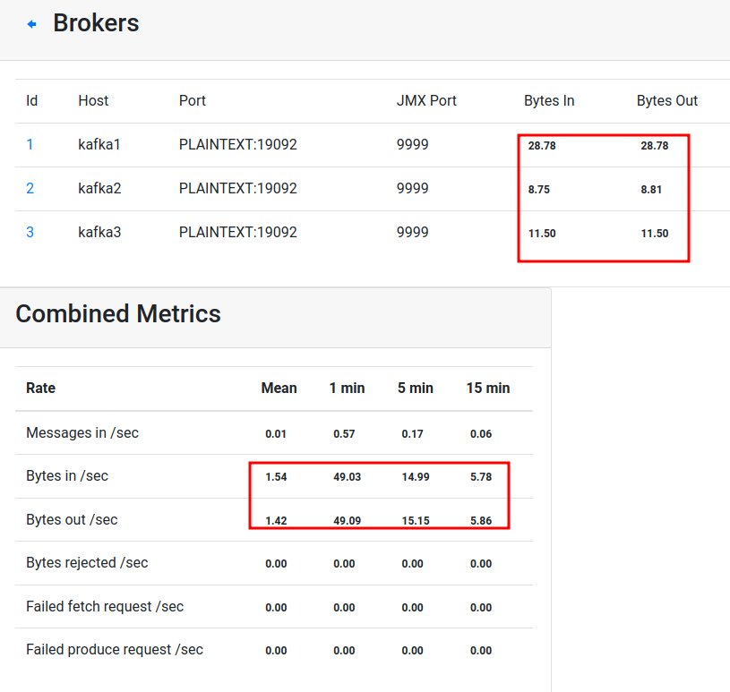

    <link rel='stylesheet' href='assets/css/main.css'/>

# Dockerized Kafka - Kafka-dev environment

## Overview

We are going to test `kafka-dev` image

## Runtime

15 mins

## Step 1: Overview of `kafka-dev` environment

Confirm that you have the single broker container running. If not, start it like you did in the last lab.

kafak-dev is a very handy container with a lot of common packages installed to work with Kafka.

Docker hub : [elephantscale/kafka-dev](https://hub.docker.com/r/elephantscale/kafka-dev)

Inspect the project [kafka-dev](https://github.com/elephantscale/kafka-in-docker/tree/main/kafka-dev)

If you didn't clone the repo in the last lab, do it now.

```bash
cd
git clone   https://github.com/elephantscale/kafka-in-docker
```

## Step 2: Try the environment

```bash
cd kafka-in-docker
bash kafka-dev/run-kafka-dev.sh
```

## Step 3: It has all kafka utils installed

```bash
# within kafka-dev container
    kafka-topics.sh --bootstrap-server  kafka1:19092  --list
```

## Step 4: Python Cluster Verifier

A nice python utility to verify connection and print out cluster details

```bash
# execute this within kafka-dev container
python /python_kafka_test_client.py   kafka1:19092
```

## Step 5: Run a python consumer

Inspect file : [sample-app-python
/consumer.py](https://github.com/elephantscale/kafka-in-docker/blob/main/sample-app-python/consumer.py)

ON **terminal-1** start a dev container.

Note that you have to start the container as shown below, or you will not mount the files needed for the class in the container.

```bash
# on docker host
cd kafka-in-docker
bash kafka-dev/run-kafka-dev.sh
```

Start consumer in dev-client

```bash
# execute this within kafka-dev container
cd sample-app-python
python  consumer.py
```

## Step 6: Run python producer

Inspect file: [sample-app-python/producer.py](https://github.com/elephantscale/kafka-in-docker/blob/main/sample-app-python/producer.py)

ON **terminal-2** start a dev container

```bash
# on docker host
cd kafka-in-docker
bash kafka-dev/run-kafka-dev.sh
```

Start consumer in dev-client

```bash
# execute this within kafka-dev container
cd sample-app-python
python  producer.py
```

You should see data flowing from producer --> consumer.

Inspect cluster traffic in Kafka manager 




## Exercise

Refer to [kafka dev usage guide](https://github.com/elephantscale/kafka-in-docker/tree/main/kafka-dev)

We just sent data from `python producer` --> `python consumer`

### Task- : `Java Producer` --> `Python consumer`

Follow the guide to build java application.  And run a Java producer.

Make sure you see results on python consumer

### Task 2: Multiple consumers

Run multiple consumer:
- python consumer
- java consumer

Run a producer.  Can be python or Java

Make sure you see data flowing from producer into multiple consumers