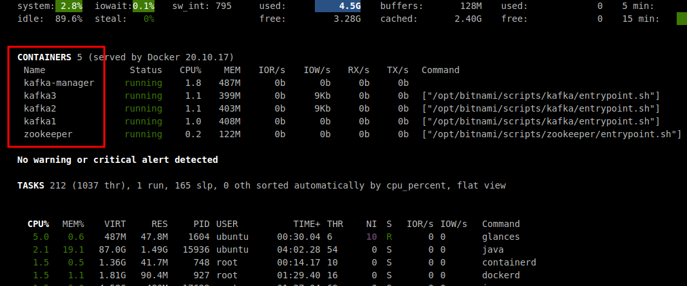

<link rel='stylesheet' href='assets/css/main.css'/>

# Dockerized Setup - Multi Broker Kafka

## Overview

We are going to run a multi node Kafka using Docker

## Runtime

40 mins

## Step 1: Stop any Running Kafka services

Use `jps` to confirm your local kafka cluster isn't running. If it is, shut it down as before.

If the docker single kafka cluster is running, shut it down as shown in the last lab.

```bash
# on docker host

cd ~/kafka-in-docker
bash stop-kafka-single.sh
docker ps
```

Use `docker ps` to ensure that `kafka-manager` is not running. If it is, then shut it down using

```bash
docker stop kafka-manager
```

And kafka-manager can be stopped by

```bash
docker stop kafka-manager
```

Use the following command to make sure:

```bash
docker ps
```

## Step 2 : Overview of kafka-in-docker


This stack has:

- 1 x Zookeeper
- 3 x Kafka brokers
- Kafka UI Manager


 

* Zookeeper container listens on port 2181 on localhost and docker network
* There are 3 kafka broker containers running
* Each Kafka broker has 2 listeners.
    - port 19092 for docker network
    - one of the ports 9092 or 9093 or 9094, that is mapped to localhost
* Kafka docker hostnames are `kafka1`, `kafka2`, `kafka3`
* All zookeeper/kafka containers are mapped to local volumes, so the data is safe

**Note**

*The storage used by the brokers is persistent. That means, that when you shut down the broker containers, the volumes they 

## Step 3: Multi Broker Kafka Start

```bash
cd   kafka-in-docker
bash start-kafka-multi.sh
```


## Step 4: Verify multi broker kafka is running


Verify you have 3 kafka brokers running!

Also check `glances` output.  You should see multiple kafka containers running!





## Step 5: Register Kafka Cluster with Kafka Manager

Remember to access from a browser in your sandbox.

Register with these details

- cluster name : my-kafka
- zookeeper :  zookeeper:2181  (careful, no typos here!)
- enable JMX
- enable consumer polling


## Step 6: Create a test topic

### Option 6-A: Using Kafka Manager (Easiest)

Create a `test` topic with

- replica factor = 3
- partitions = 10


### Option 6-B: Using CLI

Login to Kafka container

```bash
# on docker host
cd   kafka-in-docker

docker-compose  -f docker-compose-kafka-multi.yml  exec  kafka1  bash
```

```bash
# within kafka container

# See current topics
kafka-topics.sh --bootstrap-server kafka1:19092  --list

# Create a new topic
kafka-topics.sh  --bootstrap-server kafka1:19092  --create --topic test --replication-factor 3  --partitions 10

# Describe topic
kafka-topics.sh  --bootstrap-server kafka1:19092   --describe --topic test 
```

## Step 7: Inspect `test` topic in Kafka Manager

Look for the following:

- Inspect `leader` for partitions
- Inspect `replicas` for partitions

Discuss your findings.

## Step 8: Let's send some data through

### 8.1 - Start console consumer

On **terminal-1**, login to `kafka1` container

```bash
# on docker host
cd   kafka-in-docker

docker-compose  -f docker-compose-kafka-multi.yml  exec  kafka1  bash
```

```bash
# within docker container

kafka-console-consumer.sh  --bootstrap-server kafka1:19092  --property print.key=true --property key.separator=":"  --topic test
```

### 8.2 - Start console producer

On **a second terminal**  login to `kafka2` container

```bash
# on docker host
cd   kafka-in-docker

docker-compose  -f docker-compose-kafka-multi.yml  exec  kafka2  bash
```

```bash
# within docker container

kafka-console-producer.sh --bootstrap-server kafka2:19092  --topic test
```

Type something in producer terminal like this

```
1
2
a
hi
```

You should see the same data is coming out on consumer console!

Pretty cool, eh!


## Step 9: Inspect `test ` topic in Kafka Manager

Look for the following:

- how is the data distributed?  Which partitions are getting data

Discuss your findings.

## Step 10: Clean up

Shutdown the docker cluster using:

```bash
cd   kafka-in-docker
bash stop-kafka-multi.sh
```

## Lab done! 👏  