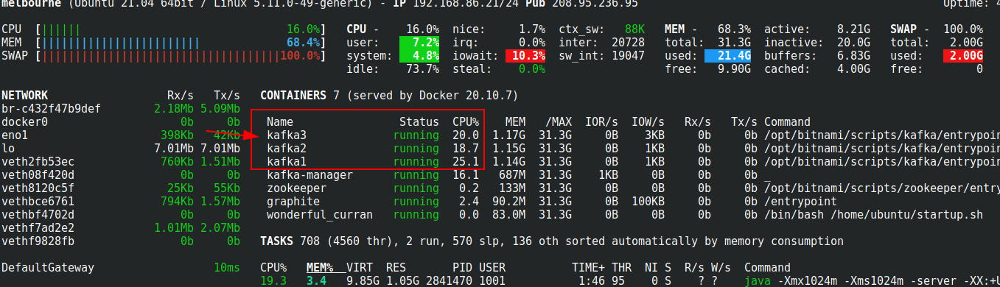

<link rel='stylesheet' href='assets/css/main.css'/>

# Benchmark 

## Overview

Quick producer benchmark

## Runtime

15 mins

## Step 1: Make sure Kafka stack is running

You can start it as follows:

```bash
cd kafka-in-docker
bash start-kafka-multi.sh
```

## Step 2: Access Kafka Manager

Access kafka manager on port number 9000.

Make sure all 3 brokers are up

## Step 3: Create a bunch of benchmark topics

From Kafka manager create a topic as follows

### `benchmark1`

    * Name : `benchmark1`
* partitions : 1
* replication : 1

### `benchmark2`

* Name : `benchmark2`
* partitions : 10
* replication : 1

### `benchmark3`

* Name : `benchmark3`
* partitions : 10
* replication : 3

## Step 4: Import Benchmark project in Eclipse

Import project from : `2423-Kafka-Labs/labs/benchmark`

## Step 5: Run Benchmark code

Inspect file : [labs/benchmarks/src/main/java/x/benchmark/BenchmarkProducer.java](labs/benchmarks/src/main/java/x/benchmark/BenchmarkProducer.java)

Change the topic name around line number 110 to run the code with each of the three topics. 

For each of the topics, run the benchmark using the three different producer modes by uncommenting out the appropriate line.

Note that the fire and forget option is sending one million messages while the other two are sending 100,000 messages.


```java
BenchmarkProducer producer = new BenchmarkProducer("benchmark1", 100000, SendMode.SYNC);
```

**Run the code**

**Observe Kafka container performance in Glances-UI**



## Step 6: Measure stats

**Run the benchmark for each benchmark topic**

Measure results from benchmark. Record the results in the spreadsheet `04-1-Producer-benchmark.xlsx` in the lab folder.

The spreadsheet already contains some sample data from a test run. Replace these with your results. Note that your results will not be exactly the same as the sample but should be roughly comparable. 

## Step 7: Discuss Results

Can you explain the variation in results?
