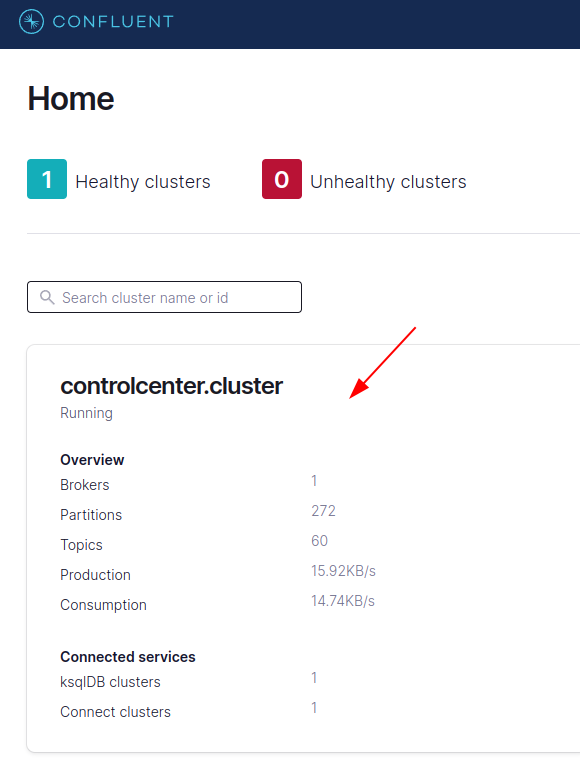
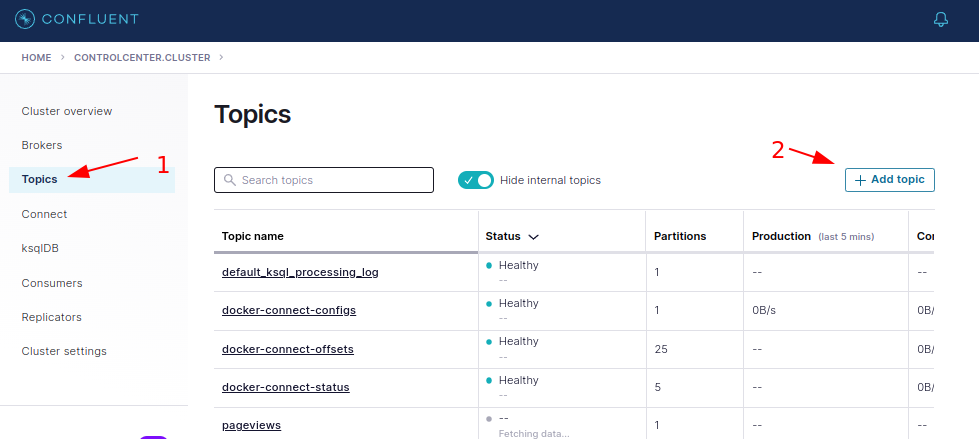
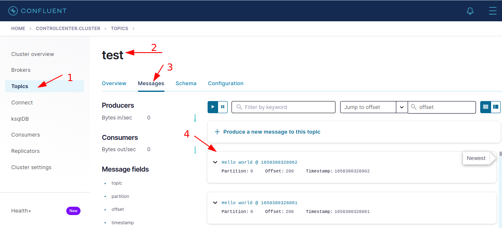

<link rel='stylesheet' href='assets/css/main.css'/>

# Confluent Stack Install

## Overview

We will setup Confluent stack here

## Runtime

1 hr

## Step-1: Shutdown Any Running Kafka Stack

```bash
cd  kafka-in-docker
./stop-kafka-multi.sh
```

Verify by doing a `docker ps` that no Kafka is running

```bash
docker ps
# or
 docker ps --format 'table {{ .ID }}\t{{ .Names }}\t{{.Image}}'
```

## Step-2: Inspect the Confluent Stack Project

Project home page: [confluentinc / cp-all-in-one](https://github.com/confluentinc/cp-all-in-one)

[docker-compose.yml](https://github.com/confluentinc/cp-all-in-one/blob/7.2.0-post/cp-all-in-one/docker-compose.yml)

[Instructions](https://docs.confluent.io/platform/current/quickstart/ce-docker-quickstart.html#quickstart)

## Step-3: Download Confluent Stack Docker Compose file

```bash
mkdir  confluent
cd confluent
curl --silent --output docker-compose.yml \
  https://raw.githubusercontent.com/confluentinc/cp-all-in-one/7.2.0-post/cp-all-in-one/docker-compose.yml
```

Start the stack:

```bash
# time measures how much time it takes

time docker-compose up -d
```

This will take a few minutes to download all components and startup

Verify services are up by

```bash
docker-compose ps
```

### Troubleshooting tips

After a few minutes, if the state of any component isn’t Up, run the docker-compose up -d command again, or try `docker-compose restart <image-name>`, for example:

```bash
docker-compose restart control-center
```

Also you can inspect logs for any component like this:

```bash
docker-compose logs broker

# to page through
docker-compose  logs broker | less -R

# to watch logs live
docker-compose logs -f broker
```


Sometimes, some components of the stack will fail to come up.  You can monitor the status by 

```bash
docker-compose ps
```

And try to restart by

```bash
docker-compose up -d
```

## Step-4: Access Control Center

If control center is up, it will be available on port **9021**

YOu can also use your vm IP address and a browser on your local machine.

```basg
http://192.168.1.1:9021
```
Or use the browser in the vm with localhost:9021



**Click on the cluster to see more details**

**Click around and explore**

## Step-5: Using Confluent Stack

Confluent stack has 1 broker.  Let's send some messages to Confluent kafka.

### 5.1 - Create a `test` topic

First create a new topic called **test** in Confluent.  Use the UI as follows:



### 5.2 - Run Producer

Working project : `labs/kafka-api`

Import this project.

Run `SimpleProducer`.  This will publish messages into `test` topic.

### 5.3 - Inspect `test` topic in Confluent UI



### pretty cool,eh? 😎

## Step-6: KSQL and More

We will be following [this tutorial](https://docs.confluent.io/platform/current/quickstart/ce-docker-quickstart.html#quickstart), Step 2 onwards

**Execute each step carefully;  do not skip any steps!**
