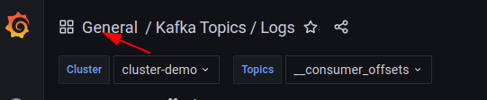
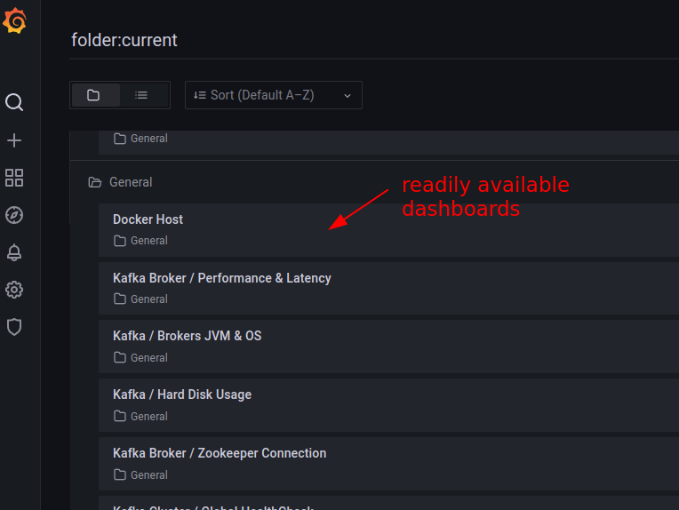

<link rel='stylesheet' href='assets/css/main.css'/>

# Starting with Metrics

## Overview

We will setup metrics stack

## Runtime

30 mins

## Step-1: Shutdown Any Running Kafka Stack

```bash
cd  kafka-in-docker
./stop-kafka-multi.sh
```

Verify by doing a `docker ps` that no Kafka is running

```bash
docker ps
# or
 docker ps --format 'table {{ .ID }}\t{{ .Names }}\t{{.Image}}'
```

## Step-2: Start the Kafka + Metrics Stack

```bash
cd  kafka-in-docker
bash  start-kafka-metrics.sh
```

Make sure all components are up

## Step-3: Login to Grafana

Use the username/password printed out to login to Grafana.

## Step-4: See Metrics!

Access pre-built dashboards like below




